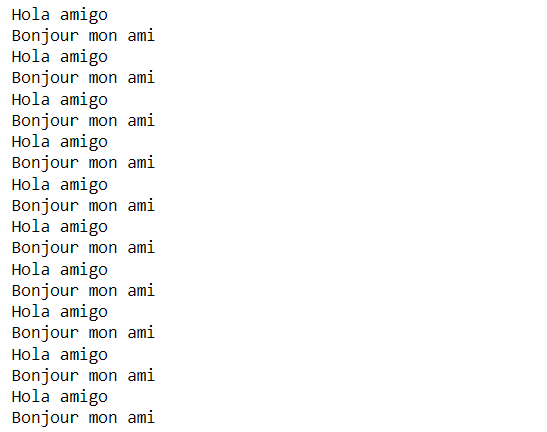
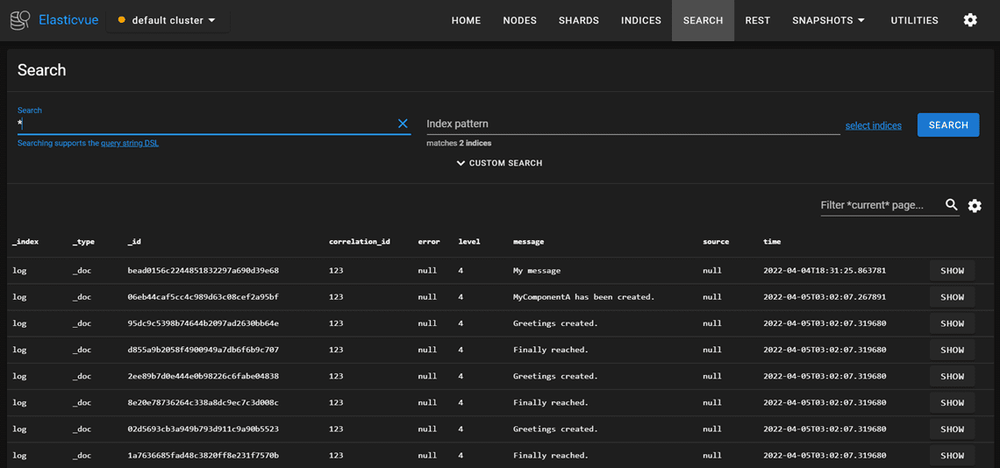



### Key takeaways

<table class="full-width-table">
  <tr>
    <td>Elasticsearch</td>
    <td>Search application. In this tutorial, it used to store log messages from different components. Pip.Services supports versions 6 and 7.</td>
  </tr>
  <tr>
    <td>ElasticSearchLogger</td>
    <td>Component used to send log messages to Elasticsearch.</td>
  </tr>
  <tr>
    <td>configure()</td>
    <td>Method used to set the values of configuration parameters.</td>
  </tr>
  <tr>
    <td>open()</td>
    <td>Method used to connect to Elasticsearch.</td>
  </tr>
  <tr>
    <td>close()</td>
    <td>Method used to close the logger and free used resources.</td>
  </tr>
  <tr>
    <td>fatal()</td>
    <td>Method used to log a fatal level or level 1 message.</td>
  </tr>
  <tr>
    <td>error()</td>
    <td>Method used to log an error level or level 2 message.</td>
  </tr>
  <tr>
    <td>warn()</td>
    <td>Method used to log a warning level or level 3 message.</td>
  </tr>
  <tr>
    <td>info()</td>
    <td>Method used to log an info level or level 4 message.</td>
  </tr>
  <tr>
    <td>debug()</td>
    <td>Method used to log a debug level or level 5 message.</td>
  </tr>
  <tr>
    <td>trace()</td>
    <td>Method used to log a trace level or level 6 message.</td>
  </tr>
</table>

### Introduction

In this tutorial you will learn how to work with the ElasticSearchLogger component, which is used to send logs to Elasticsearch. First, we will see the necessary pre-requisites. Then, we will continue by creating a custom component with an example method, running it and generating the logs. After this, we will verify that the messages reached Elasticsearch by using the Elasticvue online tool. Finally, we will improve our custom component by including several Pip.Services best practices.

### ElasticSearchLogger

This component, which is a subclass of the CachedLogger component, allows us to send log messages to Elasticsearch. In order to learn how to use it, in the following sections, we will first see how to create a custom component that uses it to send log messages to Elasticsearch. Then, we will learn how to verify that the log messages have arrived. And finally, we will improve our component by adding some interfaces and methods.

#### Pre-requisites

In order to use this component, we must first import it. The following command shows how to do this:

    
       
    

    
       
 

    
       
 

    
       
          

    
       
     

       
  Not available  


#### Creating a component with logging

Now, we can create a custom component that sends log messages. As we want to send those messages to Elasticsearch, we define our logger of type ElasticSearchLogger. We also create a method called "mymethod" with the aim of calling it and sending log messages. All log messages are considered level 4 or Info level. The code below shows how this class looks like.

    
       
    

    
       
 

    
       
 

    
       
          

    
       
     

       
  Not available  


#### Creating a ElasticSearchLogger component

Once we have our custom component, we create an instance of the ElasticSearchLogger, and configure and connect it to Elasticsearch via the open() method. In our example, we have Elasticsearch running on our machine, and we connect to it via the port 9200. The open() method requires a correlation_id, which we define as "123".

    
       
    

    
       
 

    
       
 

    
       
          

    
       
     

       
  Not available  


#### Generating logs

Now that our connection is ready, we create an instance of our custom component and run "mymethod". The following code shows how to do this.

    
       
    

    
       
 

    
       
 

    
       
          

    
       
     

       
  Not available  


And, after running the above code, we obtain the following output.

#### Our logs in Elasticsearch

We can check that Elasticsearch received our message by using a tool such as Elasticvue. This online application provides us we a UI where the received messages are displayed. The figure below shows the messages obtained after running the code in the previous section.

#### Final code

Our last step is to modify our custom component. We want it to follow the Pip.Services best practices. Thus, we add the IConfigurable and IOpenable interfaces, and the configure(), open() and close() methods. Then, we use these methods to configure, open and close our logger. The code below shows how to do this.

    
       
    

    
       
 

    
       
 

    
       
         

    
       
     

       
  Not available  


### Elasticsearch versions

At present, Pip.Services support versions 6 and 7 of Elaticsearch.

### Wrapping up

In this tutorial we have seen how to use the ElasticSearchLogger component to send log messages to Elasticsearch. First, we created a custom component that included a method and a logger. Then, we created instances of ElasticSearchLogger and of the custom component, connected our logger to Elasticsearch and run the method in order to generate log messages. After successfully running the method, we verified that Elasticsearch had received the messages by using Elasticvue, an online application that provided us with a UI. We ended the tutorial with an improved version of the custom component. 

